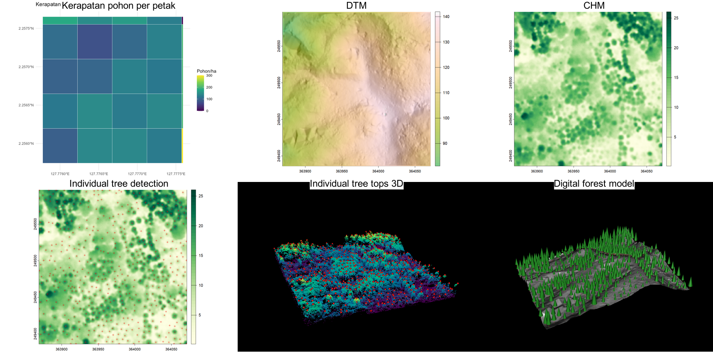

#LiDAR Tree Inventory Pipeline

Pipeline untuk mengolah data LiDAR menjadi estimasi jumlah dan tinggi pohon
per petak, memakai R (lidR, sf) dan PostgreSQL/PostGIS.

## Data
- Jenis data: point cloud LiDAR (LAS/LAZ), area terpangkas
- Kerapatan titik: 96.82 titik/m²
- Sistem koordinat: UTM zona 52N

## Metode
1. QC point cloud dan pembuangan noise
2. Klasifikasi ground dan pembuatan DTM
3. Normalisasi tinggi dan pembuatan CHM
4. Deteksi puncak pohon (local maximum filter, ws = 5)
5. Penyimpanan ke PostGIS dan perhitungan statistik per petak dengan SQL

## Hasil

- **DTM**: model medan dari titik ground
- **CHM**: tinggi kanopi di atas tanah
- **Individual tree detection**: puncak pohon dari local maximum filter pada CHM
- **Digital forest model**: visualisasi 3D; bentuk kerucut hanya simbol, bukan ukuran tajuk terukur

| Metrik | Nilai |
|---|---|
| Jumlah pohon terdeteksi | 516 |
| Rata-rata tinggi | 17.722 m |
| Kerapatan rata-rata | 136.408 pohon/ha |

## Keterbatasan
- Jumlah dan tinggi pohon adalah perkiraan dari CHM, belum divalidasi dengan data lapangan.
- Pohon di bawah tajuk pohon lain cenderung tidak terdeteksi.
- Hasil dipengaruhi parameter ws dan kualitas klasifikasi ground.

## Cara menjalankan
1. Instal paket R: lidR, sf, terra, DBI, RPostgres, RCSF, ggplot2, magick
2. Buat database PostgreSQL dengan ekstensi PostGIS
3. Jalankan skrip di folder R/ berurutan (01 sampai 05), dan SQL di folder sql/